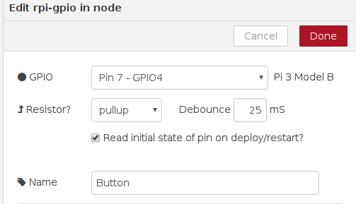
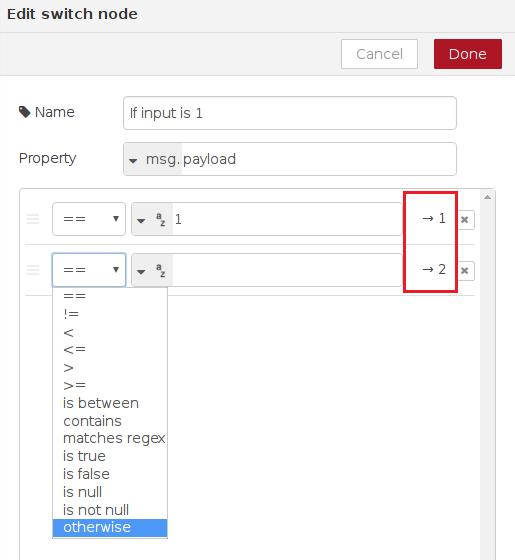
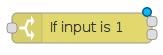
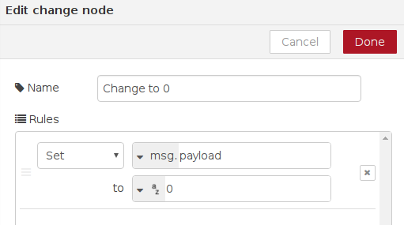
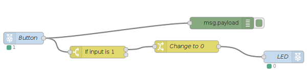
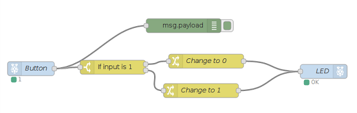

## Adding a button

- Now let's add a button to control the LED. Wire up your button to the Raspberry Pi as shown in the image below, so that your LED is still connected to GPIO pin 17, and your button is connected to GPIO pin 4:

  

- Remove your **Turn on** and **Turn off** inject nodes by clicking the node and pressing **Delete** on the keyboard. We no longer need these, as we will be controlling the LED using a physical button.

- Now we need to add a Raspberry Pi GPIO input node. This is the node with the raspberry icon on the left. Set up this node to receive input from your physical button as follows:

  

  Specifying **pullup** means that GPIO pin 4 will be set to **HIGH**, and pressing the button will cause it to go **LOW**.

- Now join up your button node output to the existing debug and LED nodes. Deploy the flow and test it by pressing the button.

  

  You will notice that the LED is lit to start with, and that pressing the button switches it off. That's not quite right! This is because we are using **pullup** as explained in the previous step, so the button pin will be **HIGH** by default. **HIGH** generates the message `1`, and this turns the LED on. When we press the button, we cause the pin to go **LOW**, generating a `0` message which turns off the LED. We need to reverse the values. We want the LED to receive the message `0` by default and the message `1` when the button is pressed.

- Remove the connection you made between the button node and the LED node by clicking on the line and pressing **Delete** on the keyboard.

- Add a switch node. This can be found in the **function** section. This node is similar to the `if`/`elif`/`else` type constructs you may have seen in Scratch or Python. You can configure it to have multiple output paths (outlined in red on the screenshot) depending on the value passed in. In this case we will set up the node so that if the property **msg.payload** is equal to 1, the first path will be followed. Click the small **Add** button at the bottom to add a second path, and for this path select **otherwise** in the drop down. This path will be followed if the input was anything other than 1. Click **Done** when you are finished.

  

- You should see your newly created switch node, with two dots on the right side for outputs. Note that the title **If input is 1** is simply a description of what the node does, and has no effect on its function.

  

- Join up the GPIO input button node to the input (left side) of the switch node.

- Now drag in a yellow **change** node from the functions section and double-click on it to configure it. We will use this node to change the message being sent. Remember: when we created the switch node, the first output was set to be followed if the input message was `1`. We will use the change node to change the message to `0`.

  

- Press **Done**, then draw a line from first output of the switch node to the change node. Then connect the output of the change node to the LED node:

  

- Now add another change node to set the **msg.payload** to `1`. Connect this node to **output 2** of the switch node and then to the LED node. This tells the flow that when the **otherwise** branch is followed (i.e. the **msg.payload** is not already `1`), we would like to change it to `1`. When you are ready, deploy your flow, and then push the physical button to confirm that it works properly.

    

