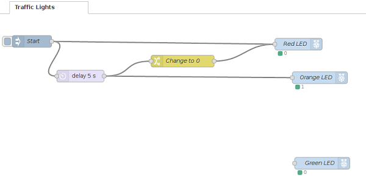

## What next?

Now that you have a single LED working, why not try wiring up two more LEDs to different pins on your Raspberry Pi, and creating a traffic light simulator? Can it be controlled with a button?

To do this, you will need to use more of the nodes from the **function** section. The **delay** node allows you to wait for a given number of seconds.

For all nodes, you can drag them in as you did before, and double-click on them to change their configuration. Don't forget that you can link a node to more than one other node. For example, the **Start** node below is linked to both the **Red LED** and the **delay 5 s** nodes. Use this example to get you started:

 

