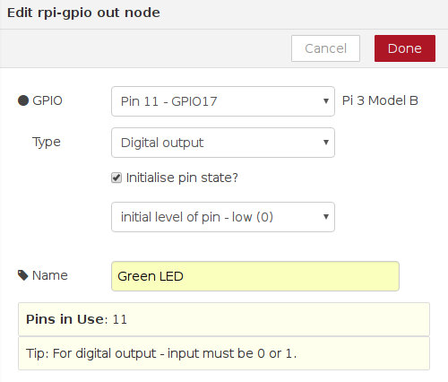

## Connecting to a GPIO pin

Programs in Node-RED are called **flows**. You can see that your blank page is labelled as **Flow 1** in the tab at the top. You can create as many flows as you want and they can all run at the same time. For this guide, we will only need one flow.

- The coloured blocks on the left side of the interface are the **nodes**. Scroll right down to the bottom of the list and you will see some nodes labelled **Raspberry Pi**.

 

- You will see two nodes with the label **rpi gpio**: these are the ones we will use to talk to the GPIO pins on the Raspberry Pi. The first one in the list, with the raspberry icon on the left, is for inputs. Using a button push to control something would be an example of an input. The second node, with the raspberry icon on the right, is for outputs. Switching on an LED would be an example of an output. Drag an output node onto the blank page in the middle.

 

- Double-click on the node and a box will appear to let you configure the node. Change the GPIO pin to be **GPIO17** and tick **Initialise pin state?**. Leave the setting for **Initial level of pin** on **low**. Give the node a name - we called it Green LED because the LED we used was green, but if yours is a different colour feel free to change the name. When you are finished, click **Done**.

 

